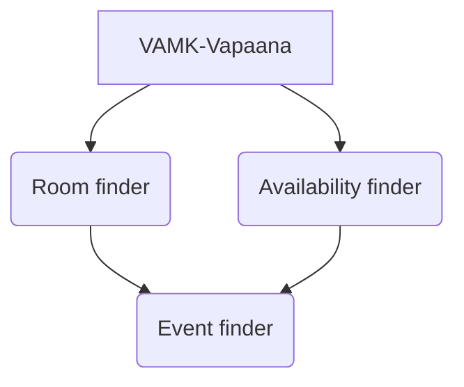

# VAMK-Vapaana
Shows a real-time map of free classrooms. Useful e.g. working on group assignments at campus.

```mermaid
graph TD;
    A[VAMK-Vapaana]-->B(Room finder);
    A[VAMK-Vapaana]-->C(Availability finder);
    B-->D(Event finder);
    C-->D;
```